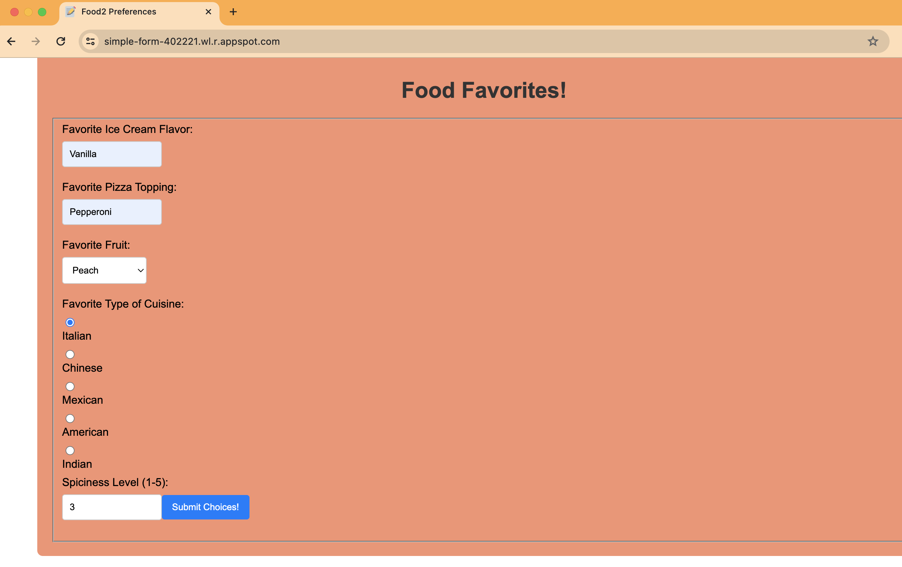
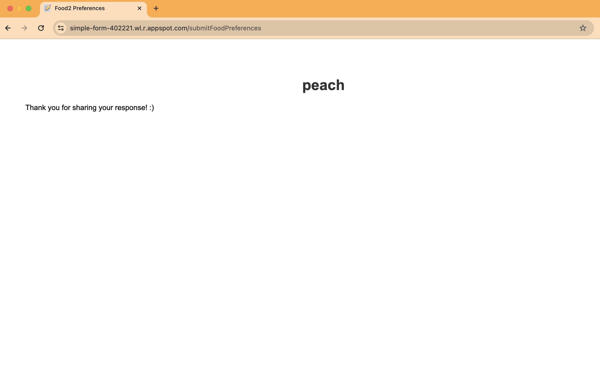
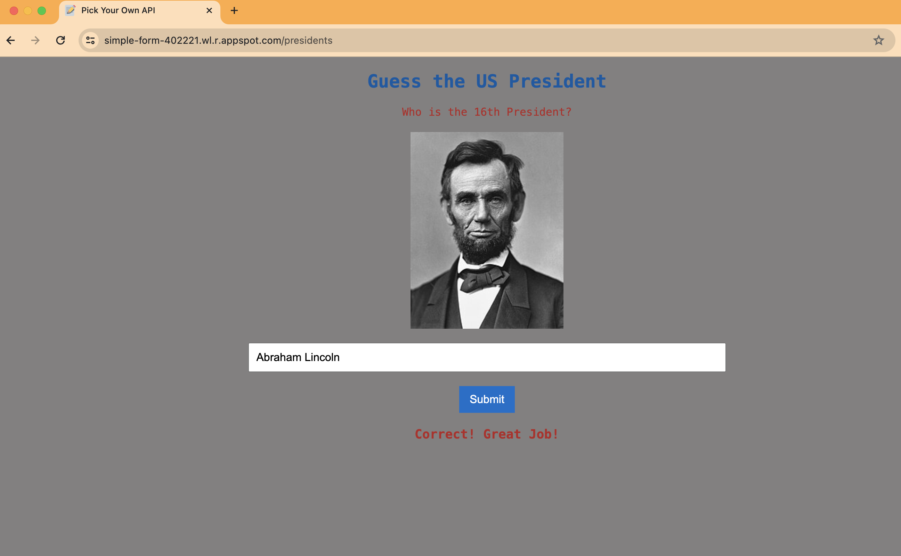
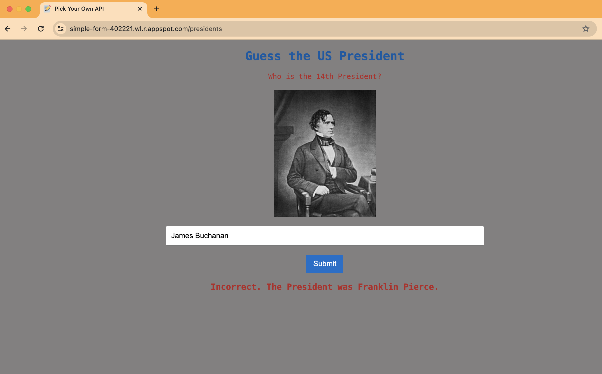
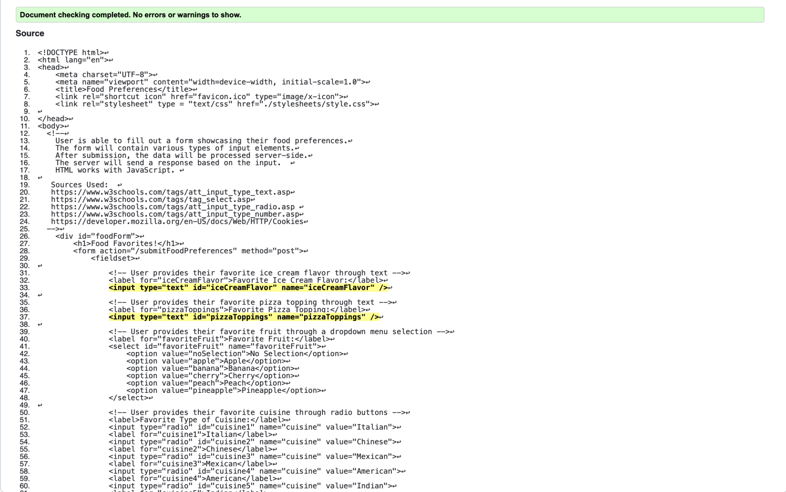
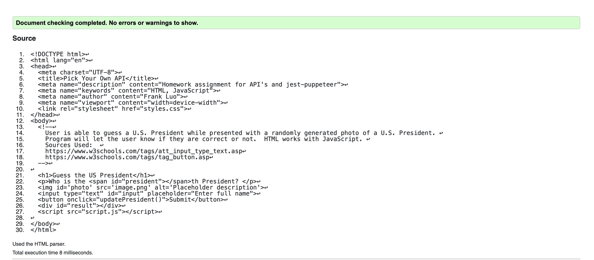
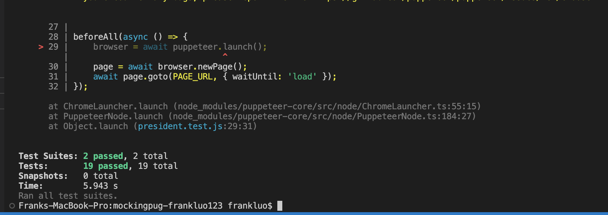
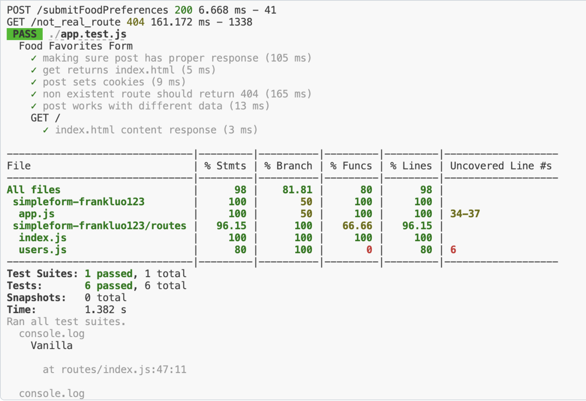
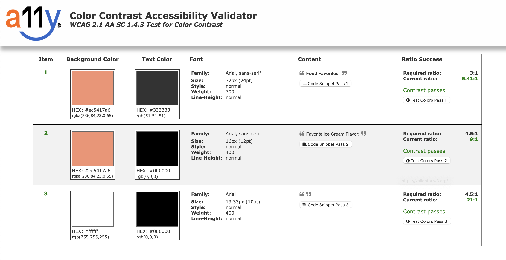
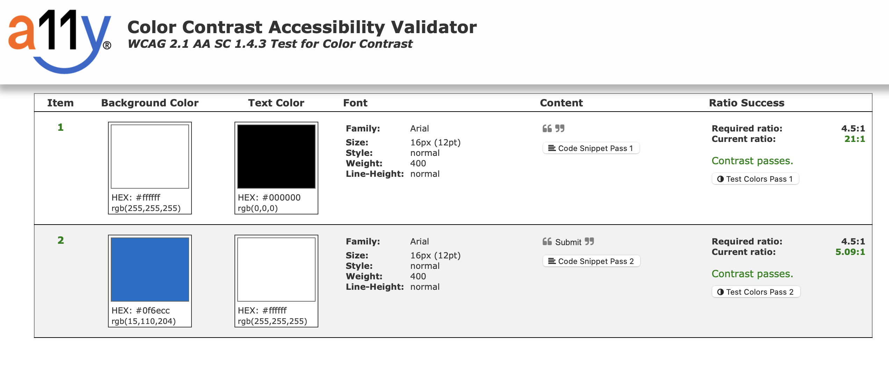

[](https://classroom.github.com/online_ide?assignment_repo_id=12413479&assignment_repo_type=AssignmentRepo)
# MockingPug 🐶🦮🐕‍🦺🐕🐾🦴

You will utilize Pug and Mocks to make updated version of prior assignments.

## Part 1 - Instructions

You will have to create this program from scratch.

0. Have express and express-generator installed. See [mozilla tutorial](https://developer.mozilla.org/en-US/docs/Learn/Server-side/Express_Nodejs/development_environment).
1. Run `npm install pug -g`
2. Run `express --view=pug` followed by `npm install`.
3. Edit [views/index.pug](views/index.pug) so that it creates the same form you used in SimpleForm. For more about how Pug (formerly Jade) works, visit [https://pugjs.org/](https://pugjs.org/). Here is some example code to get you started:

    ```pug
    block content
    #myform
    h1 Personality Quiz
        form(action="/myaction" method="post")
        fieldset
            label(for="color") Favorite Color:
            input(type="text" id="color" name="color")
            label(for="mynumber") Favorite Number:
            input(type="number" id="mynumber" name="mynumber")
            input(type="submit" value="Complete Quiz")
    ```

4. Add a favicon and reference it in [views/layout.pug](views/layout.pug). The image is completely up to you. Visit [https://favicon.io/](https://favicon.io/) for a generator.
5. Add some style to your index using CSS and make sure it is being referenced in [views/layout.pug](views/layout.pug). This can be the same from the previous assignment. Again, cite any CSS that was not originally your own.
6. Process the a post request the same way you did for SimpleForm, for now, except have it re-render the index file like in the example shown below:

    ```javascript
    router.post('/myaction', function(req, res, next) {
    console.log(req.body.color);
    console.log(req.body.mynumber);
    res.render('results', { title: 'Personality Quiz Results', personality: "You like pizza" });
    });
    ```

    Notice it is pointing to a `results` file. You'll need to make [views/results.pug](views/results.pug). Here's what it could look like:

    ```pug
    extends layout

    block content
    h1=title
    h1=personality
    ```

7. Make the site look like your `SimpleForm` activity except only using Pug files instead of straight HTML. Absolutely no HTML file will be allowed for this assignment. Use an HTML to Pug converter if you need help with writing pug syntax [https://html-to-pug.com/](https://html-to-pug.com/) but also check [this nifty tutorial](https://www.sitepoint.com/a-beginners-guide-to-pug/).
8. Add your route testing like last time.
9. Next we'll combine this assignment with `Pick Your Own API`. Update the website so that the client-side fetch javascript code file is referenced inside of layout and the site is able to render the results of the API call the same way you did for that assignment.
10. Add tests for the client-side JavaScript except update the test to mock your api calls (see [https://www.leighhalliday.com/mock-fetch-jest](https://www.leighhalliday.com/mock-fetch-jest) and [https://medium.com/fernandodof/how-to-mock-fetch-calls-with-jest-a666ae1e7752](https://medium.com/fernandodof/how-to-mock-fetch-calls-with-jest-a666ae1e7752) for examples of mocking fetch). View-Testing with puppeteer is not needed for this assignment but always encouraged.
11. Deploy your app to Google Cloud. See [https://cloud.google.com/sdk/docs/install](https://cloud.google.com/sdk/docs/install) for installation instructions, [https://cloud.google.com/nodejs/docs/setup](https://cloud.google.com/nodejs/docs/setup) for setup directions, X[https://cloud.google.com/appengine/docs/flexible/nodejs/create-app](https://cloud.google.com/appengine/docs/flexible/nodejs/create-app) for a quickstart guide, and don't forget to include the configuration `app.yaml` file [https://cloud.google.com/appengine/docs/flexible/nodejs/configuring-your-app-with-app-yaml](https://cloud.google.com/appengine/docs/flexible/nodejs/configuring-your-app-with-app-yaml):

```yaml
runtime: nodejs
env: flex
runtime_config:
  operating_system: ubuntu22
# This sample incurs costs to run on the App Engine flexible environment.
# The settings below are to reduce costs during testing and are not appropriate
# for production use. For more information, see:
# https://cloud.google.com/appengine/docs/flexible/nodejs/configuring-your-app-with-app-yaml
manual_scaling:
  instances: 1
resources:
  cpu: 1
  memory_gb: 0.5
  disk_size_gb: 10
```

Be sure that you have:

* Validated your HTML using [validator.w3.org](https://validator.w3.org/) to ensure no errors nor warnings. You might want to copy/paste the code instead of the website because Codespaces may impact things.
* Modified the documentation in the program's comments (for the files you edited) to describe the changes you made. Verify that you are well documenting your code using [JSDoc](https://www.npmjs.com/package/jsdoc) standards. You do not need to generate an API.
* Ensured that you write satisfactory unit tests and that your code passes them, with **75%** coverage, but the code you wrote needs to be completely covered not counting view testing code.
* Test your color contrast by visiting [a11y.com](https://color.a11y.com/).

## Part 2 - Reflection

Add screenshots below showing,

* Your app running on Google Cloud




* Your html validation


* Your code coverage


* Your color contrast test



Update the README to answer the following questions:

1. What are your thoughts on Pug? How did it compare with writing HTML in the prior assignments? Give an example from this assignment to demostrate your reasoning.

    Pug was not too bad to use once I figured out how it worked. Initially, there was some confusion regarding the blocks and the extension features of pug. For example, I had to let my index.pug extend from layout.pug to import the correct picture icon and CSS format. There were also less resources for pug online compared to HTML, which was a bit unfortunate. 

2. What was your experience like adding mocks to your api tests?

    Adding mock tests to the API tests were not bad once I had examples on how to do it. The example provided in class regarding Herpetology was extremely helpful. 

3. Give three reasons why we care about mocking data dependencies.

    Mocking data dependencies is a fundamental aspect of software design and unit testing. With it we can carry out isolation of componenets for testing, increase speed and efficiency for testing, as well as have greater control over testing scenarios. All of these features will allow our programs to become more robuts and fool proof. 


4. Add a link to your app running on Google Cloud here:

    The following is for the Simple Form: 

    https://simple-form-402221.wl.r.appspot.com 

    The following is for Guess the President: 

    https://simple-form-402221.wl.r.appspot.com/presidents 

5. What did you think about deploying this app to Google Cloud?

    Deploying the app to Google Cloud was not too bad because they had step by step instructions online. 